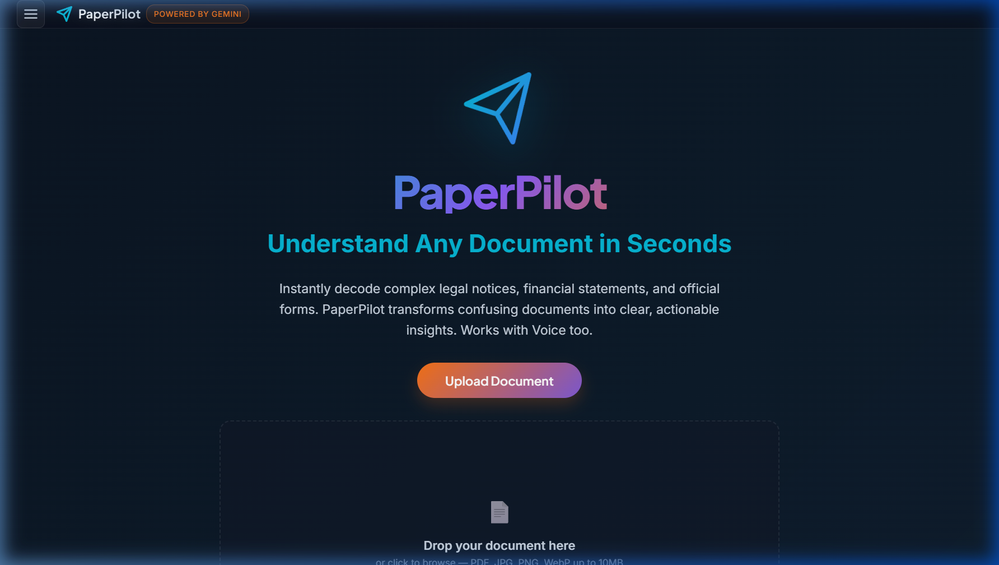

# ✈️ PaperPilot

**PaperPilot** is a premium, AI-powered document assistant designed to help everyday people decode and understand complex official documents. Whether it's a confusing government notice, a dense medical report, a legal summons, or a cryptic utility bill, PaperPilot transforms bureaucratic jargon into clear, actionable insights.

## 🌟 Key Features

-   **Multi-Format Analysis:** Upload PDFs or images (JPG, PNG, WebP, HEIC) up to 10MB.
-   **Smart Summaries:** Get 2-3 sentence "plain English" explanations of any document.
-   **Structured Navigation:**
    -   **📅 Deadlines:** Automated extraction of dates, requirements, and consequences.
    -   **✅ Action Items:** Clear, numbered steps on what you need to do next.
    -   **⚠️ Risks & Warnings:** Plain-language alerts about penalties or important considerations.
    -   **📞 Contacts:** Identifies relevant offices, roles, phone numbers, and websites.
-   **Integrated Chat & Voice:**
    -   **🗣️ Voice Consultation:** Ask follow-up questions about your document using native speech recognition.
    -   **💬 Interactive Q&A:** Deep-dive into specific clauses or requirements via a smart chat interface.
-   **Pro Utilities:**
    -   **🖨️ PDF Export:** Generate branded, professional analysis reports ready for printing or sharing.
    -   **💾 History & Quotas:** Persistent local history tracking and daily usage management.
-   **Hyper-Reliable AI:** Powered by Google Gemini with a built-in **Multi-Model Fallback Chain** (`2.0-flash` → `1.5-flash-8b` → `1.5-flash`) for maximum uptime.
-   **Premium UI/UX:** An immersive, dark-mode-locked aesthetic featuring glassmorphism, 3D floating objects, and fluid staggered animations.

## 🛠️ Tech Stack

-   **Framework:** [Next.js 15+](https://nextjs.org/) (App Router)
-   **UI Library:** [React 19](https://react.dev/)
-   **AI Engine:** [Google Gemini AI](https://ai.google.dev/) via `@google/generative-ai`
-   **Styling:** Vanilla CSS (Modern CSS variables, Flexbox/Grid, Animations)
-   **Testing:** [Vitest](https://vitest.dev/) & React Testing Library
-   **Deployment:** Docker-ready, optimized for [GCP Cloud Run](https://cloud.google.com/run)

## 🌐 Live Access

**PaperPilot** is live and accessible.

-   🔗 **Website:** [rahulmaheshwari.dev](https://rahulmaheshwari.dev)
-   📱 **How to access:** Open the **Apps** dropdown menu in the navigation bar and select **PaperPilot**.

---

*Disclaimer: PaperPilot is for informational purposes only. Always consult with a qualified professional for legal, financial, or medical advice.*
